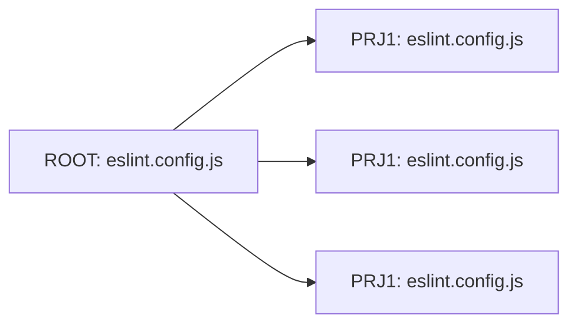
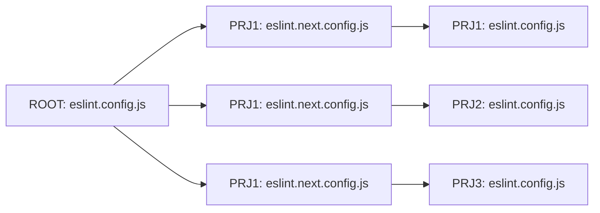

# ESLint Next Migration

Simplify and accelerate the incremental migration of ESLint rules with this automated script.

---

## Key Features

- **Idempotent**: Automatically updates configurations for new code changes with each run.
- **Backup & Extend**: Preserves the original ESLint configuration for reference and reuse.
- **Failproof**: Ensures all lint targets pass by temporarily disabling problematic rules.

---

## Motivation

Migrating to a new ESLint configuration can be challenging, particularly for large projects. Common issues include:

- **Too many errors**: A new configuration may produce numerous errors and warnings.
- **High effort**: Fixing all issues at once is time-intensive.
- **Incremental migration**: Adopting rules gradually can be difficult.
- **Progress tracking**: Monitoring migration progress often becomes tedious.
- **Configuration preservation**: Retaining original configurations for reference is rarely prioritized.

To tackle these challenges, an automated **migration strategy** is essential. This script was designed to eliminate repetitive manual tasks, ensuring a streamlined process.

---

## Workspace Types

This script supports two workspace types:

### 1. Standalone Workspace

A single repository setup with one `eslint.config.js` at the root.


### 2. Package-Based Workspace

A monorepo with multiple `eslint.config.js` files: one at the root and one for each package.



---

## Migration Strategy

To ensure flexibility and limit the impact radius of changes:

1. **Create a new `eslint.config.js`**: Ensure it passes CI and documents disabled rules with comments.
2. **Maintain a target configuration**: Store your current setup in `eslint.next.config.js`.
3. **Extend the new config**: Link `eslint.config.js` to `eslint.next.config.js` to allow progressive migration.

---

### Standalone Migration


### Package-Based Migration

A package-based repository uses:

- **Global rules**: Defined in the root `eslint.config.js`.
- **Local rules**: Managed within individual package configurations.



---

## Usage

### Run the Script

Execute the migration script using `tsx`:

```bash
pnpx tsx --tsconfig tools/tsconfig.tools.json tools/scripts/eslint-migration-next/bin.ts
```

### Simplify Execution

Add this script to your `package.json` for convenience:

```jsonc
{
  // ...
  "scripts": {
    "eslint-migration-next": "pnpx tsx --tsconfig tools/tsconfig.tools.json tools/scripts/eslint-migration-next/bin.ts"
  }
}
```

Run it with:

```bash
pnp eslint-migration-next
```

---

### What Happens

1. **Backup Configuration**:  
   Copies the existing `eslint.config.js` to `eslint.next.config.js` (if it doesn’t already exist).

```ts
// new `eslint.next.config.js`
const baseConfig = require('../../eslint.config.js');

module.exports = [
  // ... your existing config from `eslint.config.js`
];
```

2. **Update Existing Configuration**:  
   Extends from `eslint.next.config.js`, adds new rules, and disables failing rules with warnings or error counts.

```ts
// updated existing`eslint.config.js`
const nextEslintConfig = require('./eslint.next.config'); // 👈 Import the eslint next config

module.exports = [
  ...nextEslintConfig, // 👈 extend the next config
  {
    files: ['**/*'],
    rules: {
      // ⚠️ Warnings: 3
      '@typescript-eslint/no-explicit-any': 'off', // ⚠️ 18 warnings
      '@typescript-eslint/no-non-null-assertion': 'off', // ⚠️ 7 warnings
      '@typescript-eslint/no-unused-vars': 'off', // ⚠️ 2 warnings
    },
  },
  {
    files: ['*.spec.ts', '*.test.ts', '**/test/**/*', '**/mock/**/*'],
    rules: {
      // ❌️ Errors: 3
      '@typescript-eslint/no-non-null-assertion': 'off', // ❌️ 3 errors
      // ⚠️ Warnings: 3
      'no-console': 'off', // ⚠️ 2 warnings
    },
  },
];
```

---

## Example Use Cases

### 1. Initial ESLint Setup

- Set up ESLint in your project.
- **Run the script**: Execute the script to disable failing rules and warnings.
  - A backup will be created in `eslint.next.config.js`.
- Gradually fix disabled rules at your own pace.

---

### 2. Adding New Rules

- Add new rules to your ESLint configuration.
- **Run the script**: It will automatically disable the rules that fail.
- Incrementally resolve issues introduced by the new rules.

---

### 3. Handling Non-Compliant Code

- Add new, non-compliant code to your project.
- **Run the script**: It disables failing rules specific to the new code.
- Gradually update the non-compliant code to meet ESLint standards.

---

### 4. Cleaning Up After Migration

- **Run the script**: When all rules pass, it removes the `eslint.next.config.js` file.
- Consolidate settings into the primary `eslint.config.js`.

---

This structured approach ensures a seamless and scalable migration for both standalone and package-based repositories.
