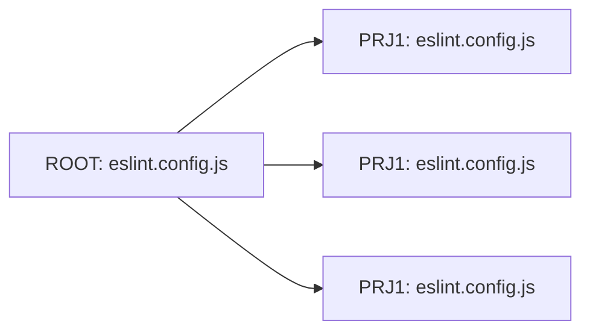
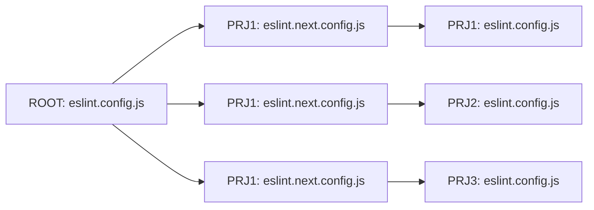

# ESLint Strategies

## Workspace Types

This script supports two workspace types:

### 1. Standalone Workspace

A single repository setup with one `eslint.config.js` at the root.


In those repositories the whole codebase shares the same configuration. The rules are maintained in a central place.

### 2. Package-Based Workspace

A monorepo with multiple `eslint.config.js` files: one at the root and one for each package.



In those repositories all projects extend a general configuration set and have project specific adjustments configured.
The rules are maintained in a different places, the root config and project configs.

---

## Next Migration Strategy

Migrating to a new ESLint configuration can be challenging, particularly for large projects. Common issues include:

---

- ❌ **Too many errors**: A new configuration may produce numerous errors and warnings.
- ❌ **Big bang refactoring**: Fixing all issues at once is time-intensive.
- ❌ **Regression prone**: Monitoring migration progress often becomes tedious.

To tackle these challenges, an automated **migration strategy** is essential. This script was designed to eliminate repetitive manual tasks, ensuring a streamlined process.

---

To ensure flexibility and limit the impact radius of changes the script:

1. **🆕 Creates a new `eslint.config.js`**:  
   Ensures it passes CI ✅ and documents disabled rules with comments 📝.
2. **📁 Maintains a target configuration**:
   Stores your current setup in `eslint.next.config.js` 📜.
3. **🔗 Extends the new config**:
   Links `eslint.config.js` to `eslint.next.config.js` 🔄 to allow progressive migration 🚀.

---

### Next Migration - Standalone


### Next Migration - Package-Based Migration

A package-based repository uses:

- **Global rules**: Defined in the root `eslint.config.js`.
- **Local rules**: Managed within individual package configurations.



## Configuration Strategy

### Warnings and Errors

By default, EsLint has two types of issues: **⚠️ warnings** and **❌ errors**.  
Warnings are less severe and can be fixed later. Errors are more severe and should be fixed immediately.

Both of them are displayed in the terminal output.

`eslint.config.js`

```javascript
module.exports = {
  rules: {
    '@typescript-eslint/no-non-null-assertion': 'warn', // ⚠️ Generates warnings in termilan  🖥️
    '@typescript-eslint/no-explicit-any': 'error', // ❌ Fails process in CI  ⚙️
  },
};
```

_terminal_

```shell
$ eslint
   <CWD>/path/to/file.ts
        62:11  error  Forbidden non-null assertion  @typescript-eslint/no-non-null-assertion
        26:1  warning  Unused eslint-disable directive (no problems were reported from '@typescript-eslint/no-explicit-any')
✖ 2 problems (1 errors, 1 warnings)
  1 errors and 1 warning potentially fixable with the `--fix` option.
```

To limit avoid terminal pollution and have a meaningful use of warnings the CLI provides parameter `--max-warnings` to fail the process if there are too many warnings.
In Nx this can be configured for all lint targets in the `nx.json`.

```json
{
  "targetDefaults": {
    "lint": {
      "options": {
        "maxWarnings": 0
      }
    }
  }
}
```

There are no hard rules, but as we want to use EsLint to improve our code quality, we should aim to fix all errors and warnings.

---

**Suggested approach:**

- Any error or warning fail the process. (`--max-warnings=0`)
- Warnings are used to improve the code style.
- Errors are used to prevent bugs.

**This avoids:**

- Terminal pollution.
- Make warnings meaningful.
- Ensure a standardized categorisation of rules.

---

### 1. Root-Level General Rules with Extensions in Packages

```shell
project-root/
  ├── eslint.config.js
  └── packages/
      ├── frontend/
      │   └── eslint.config.js
      └── node-backend/
          └── eslint.config.js
```

#### Configuration

`eslint.config.js`

```javascript
module.exports = {
  rules: {
    'no-console': 'warn',
    'no-unused-vars': 'error',
  },
};
```

`packages/frontend/eslint.config.js`

```javascript
const rootConfig = require('../../eslint.config');

module.exports = {
  ...rootConfig,
  rules: {
    ...rootConfig.rules,
    'no-console': 'off', // Override root rule
  },
};
```

### 2. Shared Configuration Package

```shell
project-root/
├── eslint-config/
│   ├── angular.js
│   └── node.js
└── packages/
    ├── frontend/
    │   └── eslint.config.js
    └── node-backend/
        └── eslint.config.js
```

#### Configuration

`eslint-config/angular.js`

```javascript
module.exports = {
  rules: {
    'no-console': 'warn',
    'no-unused-vars': 'error',
  },
};
```

`packages/frontend/eslint.config.js`

```javascript
module.exports = {
  extends: ['../eslint-config/angular.js'],
  rules: {
    'no-console': 'off', // Override shared rule
  },
};
```

### 3. Root Rules with Package Overrides

#### File Structure

```shell
project-root/
├── eslint.config.js
└── packages/
    ├── frontend/
    └── node-backend/
```

#### Configuration

`eslint.config.js`

```javascript
module.exports = {
  overrides: [
    {
      files: ['packages/frontend/**/*'],
      rules: {
        'no-console': 'off', // Adjust `no-console` for frontend
      },
    },
    {
      files: ['packages/node-backend/**/*'],
      rules: {
        'no-console': 'warn', // Adjust `no-console` in Node backend
      },
    },
  ],
};
```

### 4. Independent Package-Level Configurations

```shell
project-root/
└── packages/
    ├── frontend/
    │   └── eslint.config.js
    └── node-backend/
        └── eslint.config.js
```

#### Configuration

`packages/frontend/eslint.config.js`

```javascript
module.exports = {
  rules: {
    'no-console': 'off',
  },
};
```

`packages/node-backend/eslint.config.js`

```javascript
module.exports = {
  rules: {
    'no-console': 'warn',
  },
};
```

### 5. Combined Strategy: Root-Level Rules with Shared Configurations

```shell
project-root/
├── eslint.config.js // General root rules
├── eslint-config/   // Shared reusable configurations
│   ├── angular.js
│   └── node.js
└── packages/
    ├── frontend/
    │   └── eslint.config.js // Extends shared config and root rules
    └── node-backend/
        └── eslint.config.js // Extends shared config and root rules
```

#### Configuration

`eslint.config.js`

```javascript
module.exports = {
  rules: {
    'no-console': 'warn',
    'no-unused-vars': 'error',
  },
};
```

`eslint-config/angular.js`

```javascript
module.exports = {
  rules: {
    'specific-rule': 'error',
    'no-console': 'off', // Override general rules for projects
  },
};
```

`packages/frontent/eslint.config.js`

```javascript
const rootConfig = require('../../eslint.config');
const angularConfig = require('../../eslint-config/angular');

module.exports = {
  ...rootConfig,
  ...angularConfig,
  rules: {
    ...rootConfig.rules,
    ...angularConfig.rules,
    'no-console': 'off', // Further adjustment for frontend
  },
};
```
